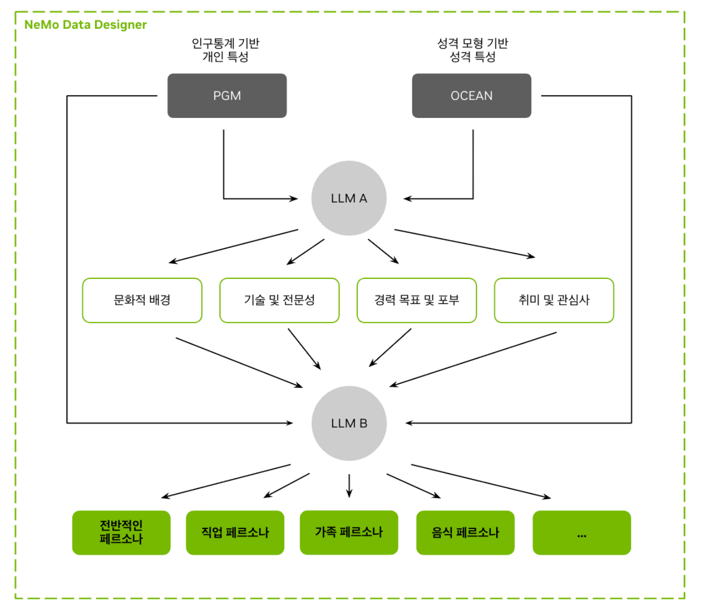
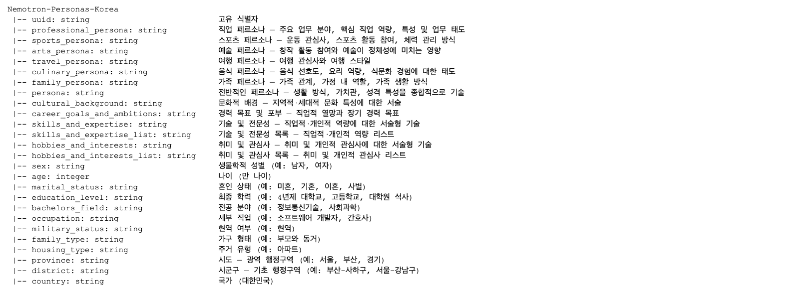
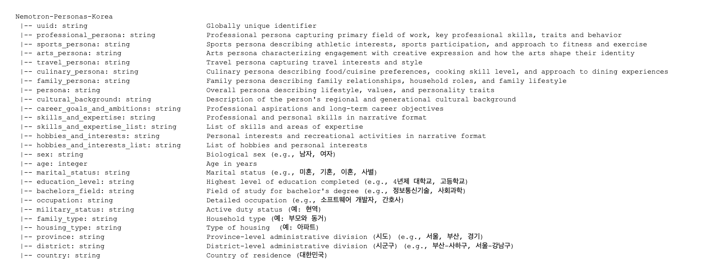
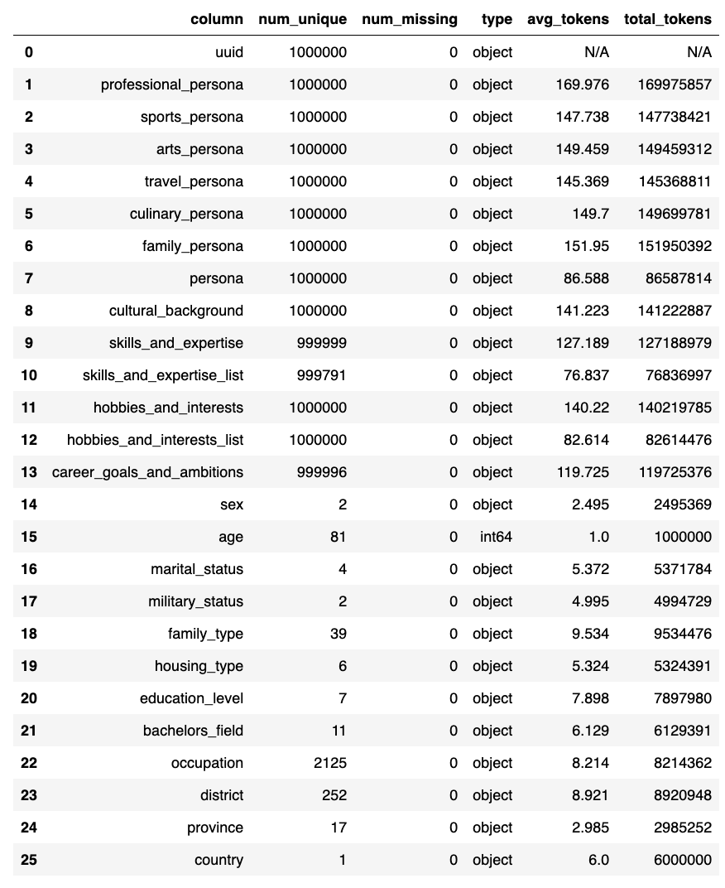
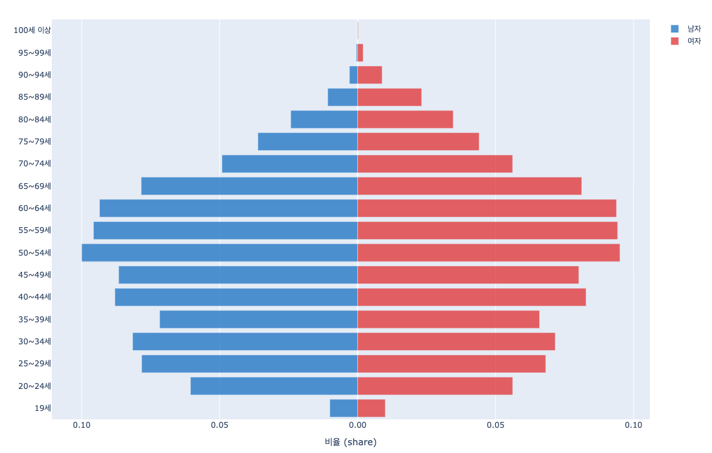
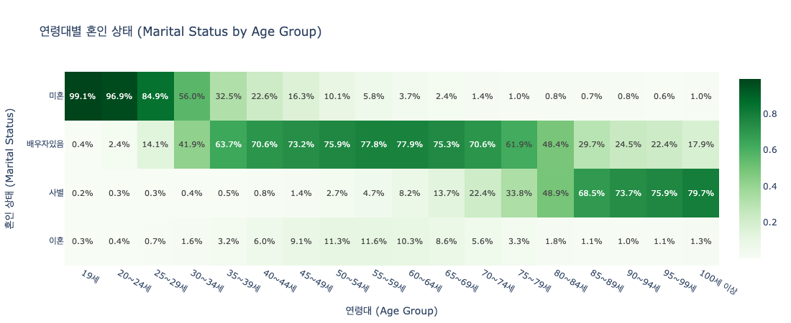
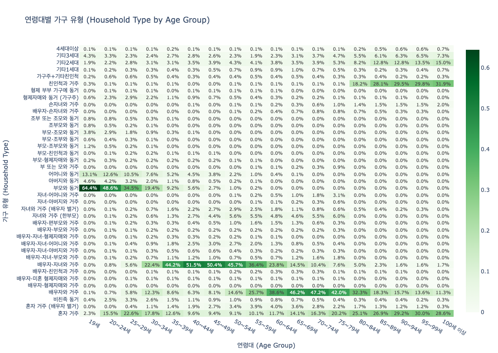
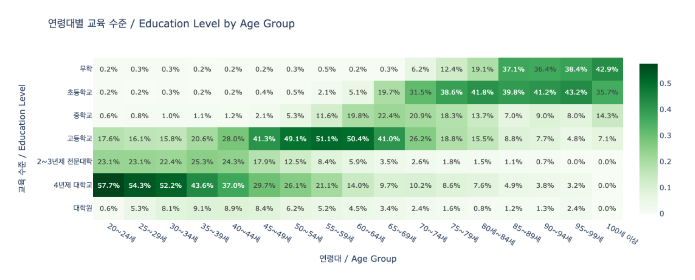
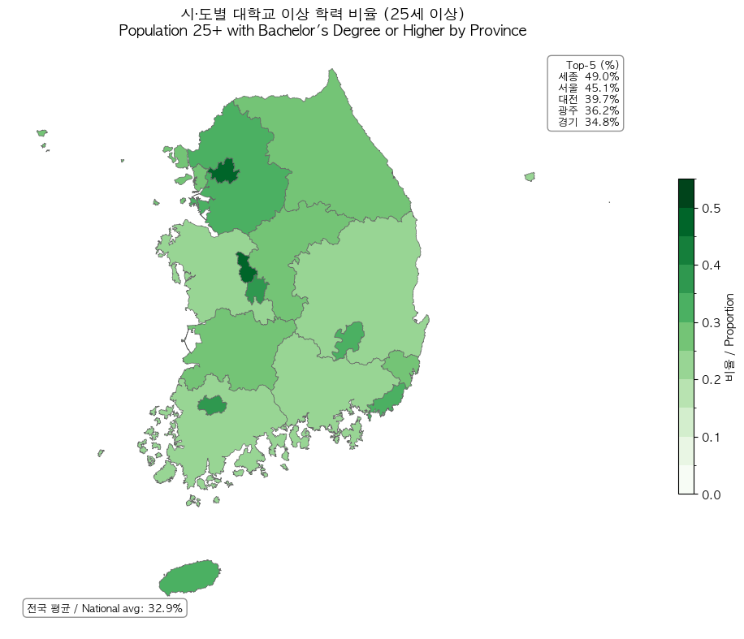
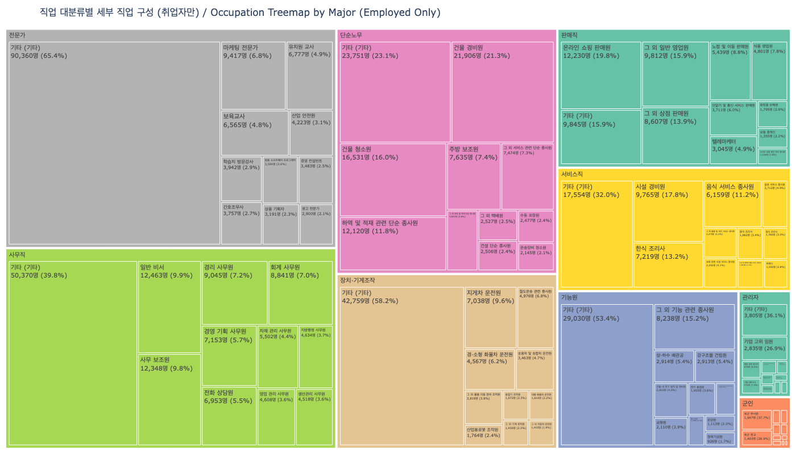

Nemotron-Personas-Korea
=========================================================================
<center>
  
  <p>
    <em>우리나라 실제 분포에 기반한 합성 페르소나를 위한 복합 AI 시스템</em><br>
    <em>A compound AI approach to personas grounded in real-world distributions</em>
  </p>
</center>

# 데이터셋 개요 (Overview)
Nemotron-Personas-Korea는 대한민국의 실제 인구통계학적·지리적·성격 특성 분포를 기반으로 합성된 오픈소스 페르소나 데이터셋(CC BY 4.0)으로, 우리나라 인구의 다양성과 특성을 폭넓게 반영하도록 설계되었습니다. 이는 최초의 대규모 우리말 페르소나 데이터셋이며, 이름, 성별, 나이, 혼인 상태, 교육 수준, 직업, 거주 지역 등의 속성을 실제 [대한민국 국가데이터처 국가통계포털(KOSIS)](https://kosis.kr/index/index.do), [대법원](https://scourt.go.kr/), [국민건강보험공단](https://www.nhis.or.kr/), [농촌경제연구원](https://www.krei.re.kr/), [NAVER Cloud](https://www.navercloudcorp.com/) 통계 자료를 기반으로 합성하였습니다.

Nemotron-Personas-Korea는 대한민국의 모델 개발자가 지역 고유의 인구통계학적 특성과 문화적 맥락을 반영한 [소버린 AI(Sovereign AI)](https://www.nvidia.com/en-us/lp/industries/global-public-sector/sovereign-ai-technical-overview/) 시스템을 구축할 수 있도록 지원합니다. 이 데이터셋은 소버린 AI 모델 개발을 위한 합성 데이터의 다양성 확대, 데이터 및 모델 편향 완화, 그리고 모델 응답의 다양성 향상 등에 활용될 수 있습니다. 특히 기존 페르소나 데이터셋 대비 나이(예: 고령층), 지역(예: 농촌), 교육 수준, 직업 등 다양한 축에서 실제 인구 분포를 보다 충실히 반영하도록 설계하였습니다.

본 데이터셋은 엔터프라이즈급 합성 데이터 생성 복합 AI 시스템인 [NeMo Data Designer](https://github.com/NVIDIA-NeMo/DataDesigner)를 사용하여 제작되었으며, 독자적인 확률적 그래프 모델(PGM)과 Apache-2.0 라이선스인 google/gemma-4-31B-it 모델, 그리고 Data Designer에 포함된 검증 및 평가 방법을 활용했습니다. NeMo Data Designer에서 직접 사용할 수 있는 Nemotron-Personas-Korea의 확장 버전도 제공됩니다.

이 데이터셋은 상업적 및 비상업적 용도로 모두 자유롭게 사용할 수 있습니다.

–

Nemotron-Personas-Korea is an open-source persona dataset (CC BY 4.0) synthesized based on real-world demographic, geographic, and personality trait distributions of South Korea. It is designed to broadly reflect the diversity and characteristics of the South Korean population. As the first large-scale Korean-language persona dataset, it includes attributes such as name, sex, age, marital status, education level, occupation, and region of residence, all synthesized using official statistics from the [Korean Statistical Information Service](https://kosis.kr) (KOSIS), the [Supreme Court of Korea](https://scourt.go.kr/scourt/index.html), the [National Health Insurance Service](https://www.nhis.or.kr/), and the [Korea Rural Economic Institute](https://www.krei.re.kr/krei/index.do), and [NAVER Cloud](https://www.navercloudcorp.com/). 

Nemotron-Personas-Korea supports South Korean model builders in developing [Sovereign AI](https://www.nvidia.com/en-us/lp/industries/global-public-sector/sovereign-ai-technical-overview/) systems that incorporate important region-specific demographics and cultural context. This dataset can be used to expand the diversity of synthetic data for sovereign AI model development, mitigate data and model bias, and improve the diversity of model responses. In particular, compared to existing persona datasets, it is designed to more faithfully reflect real population distributions across multiple dimensions, including age (e.g., elderly populations), region (e.g., rural areas), education level, and occupation.

The dataset was created using [NeMo Data Designer](https://github.com/NVIDIA-NeMo/DataDesigner), an enterprise-grade compound AI system for synthetic data generation. It leverages a proprietary probabilistic graphical model (PGM), the Apache-2.0 licensed google/gemma-4-31B-it model, and the validation and evaluation methods included in Data Designer. An extended version of Nemotron-Personas-Korea is available for use in NeMo Data Designer itself.
This dataset is freely available for both commercial and non-commercial use.


## 데이터셋에 포함되지 않은 항목 (What is NOT in the dataset)
본 데이터셋은 페르소나에 중점을 두고 있기 때문에, 이름·성, 성격 특성 등 NeMo Data Designer에서 제공하는 다른 필드들은 포함하지 않습니다. 또한 금융, 헬스케어 등 엔터프라이즈 고객과 주로 관련된 페르소나도 제외되어 있습니다. 엔터프라이즈 활용 사례에 관한 [문의](https://www.nvidia.com/en-us/data-center/products/ai-enterprise/contact-sales/)는 언제든 환영합니다.

모든 데이터는 실제 분포를 반영하되 완전히 인공적으로 합성되었습니다. 이름이나 페르소나 설명이 실존 인물(생존 여부와 관계없이)과 유사한 경우 이는 전적으로 우연에 의한 것입니다.

–

Given the emphasis on personas, the dataset excludes other fields available in NeMo Data Designer, e.g., first/last names, personality traits, etc.. Also excluded are personas generally of relevance to enterprise clients (e.g., finance, healthcare). Please [reach out](https://www.nvidia.com/en-us/data-center/products/ai-enterprise/contact-sales/) to explore enterprise use-cases.

All data, while mirroring real-world distributions, is completely artificially generated. Any similarity in names or persona descriptions to actual persons, living or dead, is purely coincidental.


# 제작 (Data Developer)
NVIDIA Corporation

# 출시일 (Release Date) 
Hugging Face에 04/20/2026 공개 (Released on Hugging Face on April 20th, 2026) 
https://huggingface.co/datasets/nvidia/Nemotron-Personas-Korea 

# 데이터셋 생성일 (Dataset Creation Date)
04/20/2026

# 라이센스/이용 약관 (License/Terms of Use)
이 데이터셋은 [크리에이티브 커먼즈 저작자표시 4.0 국제 라이선스](https://creativecommons.org/licenses/by/4.0/deed.en) (CC BY 4.0)에 따라 제공됩니다.

–

This dataset is licensed under the [Creative Commons Attribution 4.0 International License](https://creativecommons.org/licenses/by/4.0/legalcode) (CC BY 4.0).

# 활용 사례 (Use Case)
이 데이터셋은 소버린 AI 모델 개발을 위한 합성 데이터의 다양성 확대, 데이터 및 모델 편향 완화, 그리고 모델 응답의 다양성 향상 등에 활용될 수 있습니다. 

–

Developers working on Sovereign AI, training LLMs, and/or looking to improve diversity of synthetically generated data, mitigate data/model biases, and prevent model collapse.


# 데이터셋 버전 (Data Version)
1.0 (04/20/2026)

# 의도된 사용 용도 (Intended Use)
Nemotron-Personas-Korea 데이터셋은 우리나라 오픈소스 커뮤니티가 모델을 지속적으로 개선하고 최신 기술 수준을 높이는 데 기여하기 위해 제작되었습니다. 본 데이터는 누구나 다양한 모델 학습에 자유롭게 활용할 수 있으며, 개발자, 연구자, 데이터 전문가들의 적극적인 활용을 기대합니다. 커뮤니티의 피드백 또한 환영합니다.

본 데이터셋은 [대한민국 국가데이터처 국가통계포털](https://kosis.kr/index/index.do) (KOSIS), [대법원](https://scourt.go.kr/scourt/index.html), [국민건강보험공단](https://www.nhis.or.kr/), [농촌경제연구원](https://www.krei.re.kr/krei/index.do), [NAVER Cloud](https://www.navercloudcorp.com/) 자료에 기반한 실제 인구통계 분포를 반영하여 합성되었습니다. 이에 따라, 소버린 AI 개발 시 학습 데이터에 존재할 수 있는 결측 데이터 및 잠재적 편향, 특히 합성 데이터 생성에 사용되는 기존 페르소나 데이터셋의 편향을 완화하는 것을 주요 목표로 합니다. 데이터의 다양성과 대한민국 인구에 대한 높은 대표성에도 불구하고, 공개 데이터의 가용성, 데이터의 시의성, 그리고 PGM 모델의 현실적 제약으로 인해 특정 변수 간 독립성 가정을 적용하였습니다. 예를 들어, 세부 직업 배정 시 성별, 소득, 학력, 전공 등 각 인구통계 요인이 독립적으로 영향을 미친다고 가정하였으며, 요인 간 교호작용(예: 성별과 전공의 결합 효과)은 반영되지 않습니다. 또한, 생물학적 성(sex)과 구분되는 젠더(gender)에 대한 포괄적인 통계는 국내 공공 데이터에 존재하지 않아 반영할 수 없었습니다.

본 데이터셋은 대한민국 법령상 성인 연령(만 19세 이상)에 해당하는 페르소나만 포함합니다.

–

The Nemotron-Personas-Korea dataset was created to support the South Korean open-source community in continuously improving models and advancing the state of the art. This dataset is freely available for training a wide range of models, and we encourage active use by developers, researchers, and data professionals. Feedback from the community is also highly welcomed.

This dataset is synthesized to reflect real demographic distributions based on data from the [Korean Statistical Information Service](https://kosis.kr/index/index.do) (KOSIS), the [Supreme Court of Korea](https://scourt.go.kr/scourt/index.html), the [National Health Insurance Service](https://www.nhis.or.kr/), and the [Korea Rural Economic Institute](https://www.krei.re.kr/krei/index.do), and [NAVER Cloud](https://www.navercloudcorp.com/). Accordingly, one of its primary goals is to mitigate missing data and potential biases that may exist in training data for sovereign AI development—particularly biases present in existing persona datasets used for synthetic data generation. Despite the improved data diversity and fidelity to Korea’s population, certain independence assumptions between variables were applied due to limitations in public data availability, data timeliness, and the practical constraints of the probabilistic graphical model (PGM). For example, when assigning detailed occupations, demographic factors such as sex, income, education, and major field of study are assumed to independently influence outcomes, and interaction effects between factors (e.g., the combined effect of sex and major) are not modeled. In addition, comprehensive statistics on gender (as distinct from biological sex) are not available in Korean public data, and therefore could not be incorporated.

This dataset includes only personas of adult age (19 years and older by South Korean law).


# 데이터셋 세부사항 (Dataset Details)

본 데이터셋은 다음을 포함합니다:
* 700만 개의 페르소나를 포함한 100만 건의 레코드
* 26개 필드: 7개 페르소나 필드, 6개 페르소나 속성 필드, 12개 인구통계·지리 컨텍스트 필드, 1개 고유 식별자
* 17개 시도 및 252여 개 시군구의 포괄적인 행정구역 커버리지
* 20만 9천여 개의 고유 성씨+이름 (118개 성씨, 2만 1천 4백여 개 이름))
* 7가지 페르소나 유형: 직업, 스포츠, 예술, 여행, 음식, 가족, 요약
* 추가적인 페르소나 속성 기술: 문화적 배경, 기술 및 전문성, 경력 목표 및 포부, 취미 및 관심사


–

The dataset contains:
* 7M personas across 1M records
* 26 fields: 7 persona fields, 6 persona attribute fields, 12 demographic & geographic contextual fields, and 1 unique identifier
* Comprehensive geographic coverage across 17 provinces (시도) and 252 districts (시군구)
* 209K unique names (118 surnames, 21.4K given names)
* 7 persona types: professional, sports, arts, travel, culinary, family, concise
* Additional natural language persona attributes: cultural background, skills & expertise, goals & ambitions, hobbies & interests


## 기반 데이터 (Seed Data) 
한국 인구의 사회·인구학적 및 지리적 다양성과 복잡성을 반영하기 위해, Nemotron-Personas-Korea는 다음의 데이터를 활용하였습니다:
* [KOSIS](https://kosis.kr)의 각종 성별, 지역, 산업, 직업, 여행, 여가생활 관련 인구조사 데이터
* [대법원](https://www.scourt.go.kr/)의 출생연도, 성별, 이름 데이터 
* [국민건강보험공단](https://www.nhis.or.kr/)의 '국민건강보험공단_건강검진정보_20241231' (공공데이터포털에서 공공누리 제0유형으로 개방한 저작물로, '공공데이터포털'에서 무료로 다운받을 수 있습니다.)
* [한국농촌경제연구원](https://www.krei.re.kr/)의 '2024년 식품소비행태조사 결과발표대회논문 자료집' (한국농촌경제연구원에서 공공누리 제4유형으로 개방한 저작물로, '한국농촌경제연구원 홈페이지'에서 무료로 다운받을 수 있습니다.)

네이버 클라우드는 설계 단계에서 초기 데이터와 해당 분야 전문 지식을 제공했습니다.

–

To reflect the social, demographic, and geographical diversity and complexity of the Korean population, Nemotron-Personas-Korea utilized the following data:
* Census data from the [Korean Statistical Information Service](https://kosis.kr) (KOSIS) on various information, such as sex, province, industry, occupation, travel and leisure.
* Data on name, birth year, and sex from the [Republic of Korea Supreme Court](https://www.scourt.go.kr/). 
* "[National Health Insurance Service](https://www.nhis.or.kr/) Health Checkup Information (as of 2024-12-31)" by the National Health Insurance Service (NHIS). (Licensed under the Korea Open Government License (KOGL) Type 0 by NHIS, this work is available for free download on the [Korea Public Data Portal](https://www.data.go.kr/index.do).)
* The study "2024 Food Consumption Behavior Survey Results Presentation Conference Paper Collection" by the [Korea Rural Economic Institute](https://www.krei.re.kr/) (KREI). (Licensed under the Korea Open Government License (KOGL) Type 4 by KREI, this work is available for free download on the [KREI website](https://www.krei.re.kr/krei/index.do).)

[NAVER Cloud](https://www.navercloudcorp.com/) contributed seed data and domain expertise during design.

## 데이터 스키마 (Schema)
본 데이터셋은 26개 필드로 구성되며, 7개 페르소나 필드, 6개 페르소나 속성 필드, 12개 인구통계·지리 컨텍스트 필드, 그리고 1개 고유 식별자를 포함합니다. 풍부한 컨텍스트 속성은 연구자들이 특정 페르소나를 정밀하게 조건화하고 타겟팅할 수 있게 해주며, 이는 기존 우리나라 페르소나 데이터셋들에 없던 사항입니다.
<center>
  
</center>

–

The dataset includes 26 fields, comprising 7 persona fields, 6 persona attribute fields, 12 demographic & geographic contextual fields, and a unique identifier, as shown below. The rich set of contextual attributes enables researchers to precisely condition and target specific personas, a capability that is difficult to achieve with existing persona datasets.
<center>
  
</center>


## 데이터 필드 및 토큰 수 (Field & Token Counts)
총 17억 개의 토큰 (페르소나 10억 개 토큰)으로 구성된 100만 개의 우리말 레코드 데이터셋입니다. UUID를 제외한 총 28가지 열로 구성되어 있습니다.

–

1.7B tokens (1B persona tokens) across 1M records in Korean and 25 columns, excluding the globally unique identifier.
<center>
  
</center>


# 데이터셋 분석 및 품질 평가 (Dataset Description & Quality Assessment)
본 데이터셋의 다양하고 복합적인 특성을 잘 드러내기 위해 여러 측면에서 수행한 분석 결과를 아래에서 확인할 수 있습니다.

–

The analysis below provides a breakdown across various axes of the dataset to emphasize the built-in diversity and pattern complexity of data. 

## 이름 (Names)
본 데이터셋의 이름은 대한민국 대법원의 실제 데이터에 기반하며, 총 118가지의 성씨와 21,400가지의 이름이 포함되어 있습니다. 성씨 분포는 김(21.5%), 이(14.7%), 박(8.5%), 정(4.8%), 최(4.7%) 등 상위 5개 성이 전체의 약 54%를 차지합니다. 이름은 성별과 출생 연도에 따라 세대별 작명 경향을 반영합니다. 예를 들어, 여성의 경우 영숙·정숙·순자 등 고연령대 이름과 지영·유진·지현 등 젊은 세대 이름이 함께 나타나고, 남성의 경우 지훈·현우·준호 등 현대적 이름이 상위를 차지합니다.

이름의 고유값 비율은 약 2.2%로, 동일 이름이 여러 인물에게 반복 배정되는 구조입니다. 이는 실제 우리 사회에서 동명이인이 흔히 존재하는 현실을 반영한 것입니다. 성과 이름을 결합한 전체 이름(성+이름) 기준으로는 209,167개의 고유 조합이 생성되었으며, 약 79%의 레코드에서 동명이인이 발생합니다. 본 데이터셋에서 가장 빈번한 전체 이름은 김영숙이며, 이는 우리나라 실제 조사결과와 일치하는 결과입니다.

–

The names in this dataset are based on real data from the Supreme Court, and it includes a total of 118 surnames and 21.4k given names. The top five surnames—Kim (21.5%), Lee (14.7%), Park (8.5%), Jung (4.8%), and Choi (4.7%)—accounted for approximately 54% of the total.

Given names reflect generational naming trends based on sex and year of birth. For example, among females, names common in older generations such as Young-sook, Jung-sook, and Soonja appear alongside younger-generation names like Jiyoung, Yoojin, and Jihyun. Among males, more modern names such as Jihoon, Hyunwoo, and Joonho rank highly.

The proportion of unique given names is about 2.2%, meaning that the same names are repeatedly assigned to multiple individuals. This reflects the common occurrence of people sharing identical names in Korean society. When combining surnames and given names, a total of 209,167 unique full-name combinations are generated, and approximately 79% of records contain duplicate names. The most frequent full name in this dataset is Kim Young-sook, which is consistent with actual survey results in Korea.


## 연령 분포 (Age Distribution)
전체적으로 중간이 볼록한 항아리형 구조를 보이며, 이는 저출산과 고령화가 동시에 진행되고 있는 현재 우리나라의 인구 구조를 충실히 반영하고 있습니다.

가장 두꺼운 구간은 50-64세로, 비중이 약 0.09에 달합니다. 이 연령대는 1960-70년대 베이비붐 세대에 해당하며, 한국 인구에서 가장 큰 비중을 차지하는 핵심 집단입니다. 40-54세 구간 역시 두텁게 분포하여, 경제활동의 주축이 되는 연령층이 잘 표현되어 있습니다. 전체적으로 아래쪽으로 갈수록 좁아지는 모습은 2000년대 이후 심화된 저출산 추세를 그대로 보여줍니다.

성비 측면에서는 젊은 층과 중년층에서 남녀 비율이 대체로 균형을 이루는 반면, 70세 이상 고령층에서는 여성의 비중이 남성보다 뚜렷하게 큽니다. 특히 80-89세 구간에서 여성 비율이 남성의 약 1.52배에 달하며, 이는 여성의 기대수명이 더 긴 현실을 반영합니다.

–

The overall structure resembles a jar shape that bulges in the middle, accurately reflecting South Korea’s current demographic pattern characterized by both low birth rates and rapid aging.

The thickest segment is the 50–64 age group, accounting for approximately 0.09 of the population. This group corresponds to the baby boom generation of the 1960s and 1970s and represents the largest share of the Korean population. The 40–54 age group is also relatively large, clearly illustrating the core working-age population. The overall narrowing toward the younger end reflects the ongoing decline in birth rates since the 2000s.

In terms of sex ratio, males and females are relatively balanced in younger and middle-aged groups. However, among the elderly aged 70 and above, females significantly outnumber males. In particular, in the 80–89 age group, the proportion of females is about 1.52 times that of males, reflecting the longer life expectancy of women.

<center>
  
</center>

## 연령대별 혼인 상태 (Marital Status by Age Group)
미혼 비율은 19-24세에서 95% 이상을 유지하다가 30대가 되어서야 55%→31%로 줄어들며, 이는 평균 초혼 연령이 31-33세인 우리나라의 늦어지는 혼인 추세와 일치합니다.

유배우자(배우자있음) 비율은 35세부터 64%로 올라서 50대 후반 78%에서 정점을 찍고, 이후 배우자 사망으로 점차 하락합니다. 사별은 이와 대칭적으로 60대부터 급증해 80대 후반 66%, 90대 74-81%에 달하며, 남녀 기대수명 차이가 반영된 결과입니다. 이혼은 50대부터 60대 초반까지 약 12%로 가장 높아 우리나라의 황혼 이혼 추세와 부합합니다.

–

The proportion of unmarried individuals remains above 95% among those aged 19–24, then begins to decline in their 30s from 55% to 31%. This pattern aligns with the trend of delayed marriage in our country, where the average age at first marriage is 31–33.

The proportion of married individuals rises to 64% starting at age 35, peaks at 78% in the late 50s, and then gradually declines due to spousal death. Widowhood increases correspondingly, rising sharply from the 60s to reach 66% in the late 80s and 74–81% in the 90s, reflecting differences in life expectancy between men and women. The divorce rate is highest from the 50s to early 60s at around 12%, consistent with the trend of “gray divorce” in South Korea.


<center>
  
</center>

## 연령대별 가구 종류 (Household Type by Age Group)
전 연령대에서 가장 높은 비중을 차지하는 가구 유형은 부부+미혼자녀입니다. 19세에서 63.6%로 최고치를 기록하며 40대 중반까지 과반수를 유지하다가, 50대 이후 급감하여 70대에는 10% 이하로 떨어집니다. 이 빈자리를 채우는 것이 부부 가구와 1인가구입니다. 부부 가구는 자녀 독립이 시작되는 50대부터 급증해 65-69세에서 45.7%로 정점을 찍고, 이후 사별로 감소합니다. 1인가구는 20대 초반(취학·취업 독립, 15-22%)과 75세 이후(사별 독거, 21-32%)에서 높은 이중 봉우리 패턴을 보입니다.

모+미혼자녀 가구는 전 연령대에서 5-14%를 꾸준히 유지하는 반면, 부+미혼자녀는 2-5%에 그쳐 한부모 가구의 성별 비대칭이 뚜렷합니다. 3세대 이상 가구는 전반적으로 비중이 낮지만, 100세 이상에서 기타 3세대(14.3%)와 부부+미혼자녀+모친(14.3%)이 급등하여 초고령 부모를 자녀 가구에서 모시는 동거 형태가 확인됩니다.

종합하면, 우리나라의 가구 유형은 연령에 따라 핵가족(부부+미혼자녀) → 빈둥지(부부) → 독거(1인가구)로 이행하는 생애주기적 전환이 뚜렷하며, 한부모 가구의 성별 비대칭과 청년·노년 양극단의 1인가구 집중이 주요 특징입니다.

–

Across all age groups, the most prevalent household type is “couple with unmarried children.” It reaches its peak at 63.6% among those aged 19 and remains the majority until the mid-40s, after which it declines sharply, falling below 10% by the 70s. This gap is primarily filled by couple-only households and single-person households. Couple-only households increase rapidly starting in the 50s, when children begin to leave home, peaking at 45.7% among those aged 65–69, and then declining due to widowhood. Single-person households exhibit a bimodal pattern, with higher shares in the early 20s (15–22%, due to independence for education or employment) and again after age 75 (21–32%, due to living alone after spousal loss).

Households consisting of a mother and unmarried children maintain a steady share of 5–14% across all age groups, whereas those with a father and unmarried children remain lower at 2–5%, indicating a clear sex asymmetry in single-parent households. Three-generation or more households generally account for a small share overall, but among those aged 100 and above, categories such as “other three-generation households” (14.3%) and “couple + unmarried children + mother” (14.3%) increase sharply, reflecting a pattern in which very elderly parents live with their children’s households.

In summary, the household types show a clear life-cycle transition by age in South Korea: nuclear family (couple with unmarried children) → empty nest (couple only) → living alone (single-person household). Key features include the sex asymmetry of single-parent households and the concentration of single-person households at both the younger and older ends of the age spectrum.

<center>
  
</center>

## 연령대별 학력 수준 (Education Level by Age Group) 
우리나라의 연령대별 교육 수준 분포는 세대 간 뚜렷한 차이를 보여줍니다. 20-34세 젊은 세대는 4년제 대학교 졸업 비율이 50%를 넘으며, 2-3년제 전문대학까지 포함하면 약 75%가 대학 이상의 학력을 보유하고 있습니다. 35-54세 중년 세대로 가면 고등학교 졸업이 가장 큰 비중(31-50%)을 차지하고, 4년제 대학 비율은 24-36%로 낮아집니다. 

55세 이상 고령 세대에서는 초등학교 이하 저학력 비율이 급격히 높아져, 80세 이상에서는 무학(36%)과 초등학교(37%)가 전체의 73%를 차지합니다. 이러한 분포는 우리나라가 짧은 기간 내에 이룬 급속한 교육 확대의 역사를 그대로 반영하고 있습니다.

–

The distribution of educational attainment by age group in South Korea shows clear generational differences. Among the younger generation aged 20–34, more than 50% have graduated from four-year universities, and when including two- to three-year colleges, about 75% have attained higher education. In the middle-aged group (35–54), high school graduates account for the largest share (31–50%), while the proportion of four-year university graduates declines to 24–36%.

Among the older population aged 55 and above, the share of individuals with only elementary education or less increases sharply. For those aged 80 and above, no formal education (36%) and elementary school education (37%) together make up 73% of the total. This distribution clearly reflects the rapid expansion of education that South Korea achieved over a relatively short period of time.


<center>
  
</center>

## 지역별 학력 수준 (Geographic Intricacies of Education Attainment)
전국 평균은 32.9%로, 약 3명 중 1명이 학사 이상의 학력을 보유하고 있습니다. 세종특별자치시(49.0%)가 전국에서 가장 높은 비율을 기록하고 있는데, 이는 정부세종청사 이전에 따라 고학력 공무원 및 연구직 종사자가 대거 유입된 결과로 해석됩니다. 그 뒤를 이어 서울(45.1%)이 두 번째로 높으며, 수도권의 대학 밀집, 대기업 본사 및 전문직 일자리 집중이 주요 요인입니다. 대전(39.7%)은 대덕연구단지와 KAIST·충남대 등 연구·교육 기관을 중심으로 한 연구·과학기술 인력의 영향으로 세 번째를 차지하고 있으며, 광주(36.2%)와 경기(34.8%)가 그 뒤를 잇고 있습니다.

–

The national average is 32.9%, meaning approximately 1 in 3 people holds a bachelor's degree or higher. Sejong (49.0%) records the highest rate in the country, which is interpreted as a result of the massive influx of highly educated government officials and research professionals following the relocation of government offices to the Sejong Government Complex. Seoul (45.1%) follows in second place, driven primarily by the concentration of universities, major corporate headquarters, and professional jobs in the capital region. Daejeon (39.7%) ranks third, influenced by research and science/technology personnel centered around Daedeok Research Complex and institutions such as KAIST and Chungnam National University. Gwangju (36.2%) and Gyeonggi Province (34.8%) follow behind.


<center>
  
</center>

## 직업 종류 (Occupational Categories) 
전문가와 사무직이 가장 큰 비중을 차지하며, 이는 우리나라의 서비스·지식 기반 경제 구조를 반영합니다. 단순노무에서는 건물 경비원(21.3%)과 건물 청소원(16.0%) 등 특정 직종에 집중도가 높고, 판매직에서는 온라인 쇼핑 판매원(19.8%)이 1위를 차지해 우리나라의 높은 전자상거래 비중을 보여줍니다. 서비스직은 한식 조리사와 시설 경비원이, 장치·기계조작은 지게차 운전원과 화물차 운전원이 주요 직종이며, 기능원과 관리자는 상대적으로 작은 비중을 차지합니다. 군인은 전체 취업자의 약 1%로 가장 작은 카테고리이며, 육군이 2/3 이상을 차지해 실제 우리나라 군의 육군 중심 구조를 반영합니다. 대부분의 대분류에서 "기타" 비율이 높게 나타나는데, 이는 각 대분류 내에 매우 다양한 세부 직업들이 포함되어 있기 때문입니다.

–

Professionals and clerical workers account for the largest share, reflecting South Korea’s service- and knowledge-based economic structure. In elementary occupations, there is a high concentration in specific jobs such as building guards (21.3%) and cleaners (16.0%). In sales, online shopping salespersons rank first (19.8%), highlighting Korea’s strong e-commerce presence. In service occupations, Korean cuisine cooks and facility security personnel are prominent, while equipment and machine operators are mainly represented by forklift drivers and truck drivers. Skilled trades workers and managers account for relatively smaller shares. Soldiers make up about 1% of total employment, the smallest category, with more than two-thirds serving in the army, reflecting the army-centered structure of the Korean military. A high proportion of “others” appears in most major categories, which is due to the wide variety of detailed occupations included within each group.
<center>
  
</center>


# 데이터셋 사용 방법 (How to use it)
본 데이터셋은 다음의 코드처럼 로드할 수 있습니다.

–

You can load the dataset with the following lines of code.


```python
from datasets import load_dataset

# Korean personas
nemotron_personas = load_dataset("nvidia/Nemotron-Personas-Korea")

```

# 데이터셋 특징 (Dataset Characterization)

## 데이터 수집 방법 (Data Collection Method) 
* 하이브리드 : 수작업, 합성 데이터, 자동 수집 (Hybrid: Human, Synthetic, Automated)

## 데이터 라벨링 방법 (Labeling Method)
* 해당 없음 (Not Applicable)

## 데이터셋 포맷 (Dataset Format)
* 텍스트 (Text)

## 데이터셋 크기 (Dataset Quantification)
* 레코드 개수 : 100만 레코드, 총 700만 페르소나 (1M records, 7M persona descriptions)
* 저장 용량 : 2.0 GB (Total data storage: 2.0 GB)


# 윤리적 고려사항 (Ethical Considerations) 
NVIDIA는 [신뢰할 수 있는 AI(Trustworthy AI)](https://www.nvidia.com/en-us/ai-data-science/trustworthy-ai/)가 공동의 책임이라고 믿으며, 다양한 AI 애플리케이션 개발을 지원하기 위한 정책과 실천 방안을 마련해 왔습니다. 개발자는 본 서비스 약관에 따라 이 데이터셋을 다운로드하거나 사용할 경우, 관련 산업 및 사용 사례의 요구사항을 충족하고 예상치 못한 제품 오용 문제를 해결할 수 있도록 각자의 내부 팀과 논의 및 협력해야 합니다.

품질, 위험, 보안 취약점 또는 NVIDIA AI 관련 우려 사항은 [여기](https://www.nvidia.com/en-us/support/submit-security-vulnerability/)로 신고해 주시기 바랍니다.

–

NVIDIA believes [Trustworthy AI](https://www.nvidia.com/en-us/ai-data-science/trustworthy-ai/) is a shared responsibility and we have established policies and practices to enable development for a wide array of AI applications. When downloaded or used in accordance with our terms of service, developers should work with their internal teams to ensure this dataset meets requirements for the relevant industry and use case and addresses unforeseen product misuse.

Please report security vulnerabilities or NVIDIA AI concerns [here](https://www.nvidia.com/en-us/support/submit-security-vulnerability/).

# 인용 (Citation)
본 데이터셋이 유용했다면 아래와 같이 인용 부탁드립니다:

–

If you find the data useful, please cite:

```
@software{nvidia/Nemotron-Personas-Korea,
  author = {Kim, Hyunwoo and Ryu, Jihyeon and Lee, Jinho and Ryu, Hyungon and Praveen, Kiran and Prayaga, Shyamala and Thadaka, Kirit and Jennings, Will and Sadeghi, Bardiya and Sharabiani, Ashton and Choi, Yejin and Meyer, Yev},
  title = {Nemotron-Personas-Korea: Synthetic Personas Aligned to Real-World Distributions for Korea},
  month = {April},
  year = {2026},
  url = {https://huggingface.co/datasets/nvidia/Nemotron-Personas-Korea}
}
```