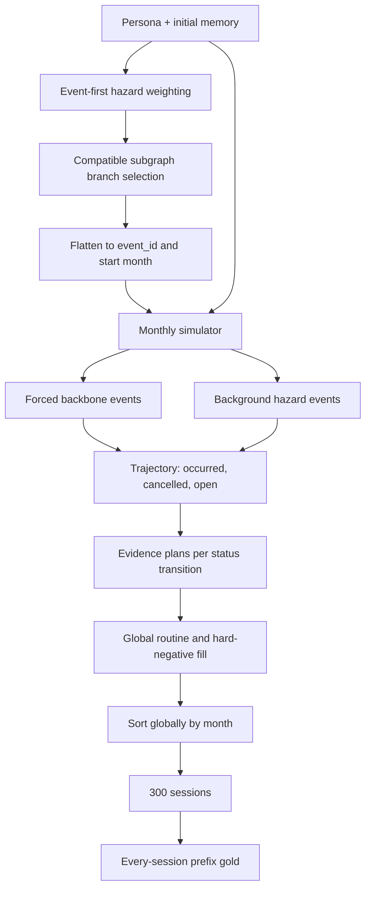
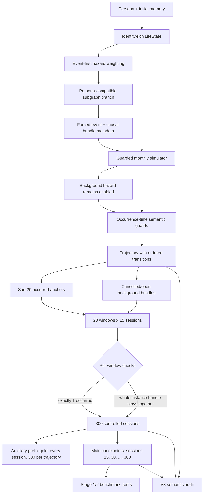
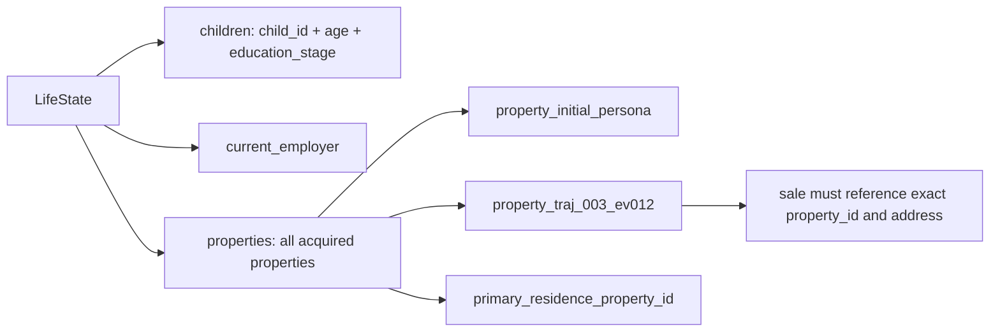

# Controlled v3 생성 흐름

## 핵심 계약

v3는 `controlled` 데이터만 만든다. 한 trajectory는 occurred event 20개와 session 300개로 구성되고, session은 15개씩 20개 window로 나뉜다. 각 window에는 해당 window가 담당하는 occurred event가 정확히 1개 있다. 같은 window 안에 cancelled event 또는 아직 weak_signal/upcoming인 background event가 추가로 존재할 수 있지만 occurred quota에는 포함되지 않는다.

session 번호는 실시간 간격을 뜻하지 않는다. 서로 다른 session이 같은 달에 있을 수 있고, 같은 달의 상태 변경은 `transition_order`로 구분한다. 따라서 15 session이 몇 주 또는 몇 달을 의미한다고 가정하지 않는다.

## v2의 실제 흐름

v2도 subgraph만으로 모든 사건을 결정한 것은 아니다. subgraph는 causal backbone을 만들고, 같은 simulator에서 background hazard가 계속 작동했다. 문제는 branch를 `(event_id, month)`로 평탄화하면서 subgraph/episode 식별 정보가 사라졌고, 대화 계획을 전역 시간순으로 채워서 한 event의 lifecycle session이 임의의 15-session 경계를 넘거나 한 구간에 여러 occurred event가 들어갈 수 있었다는 점이다.

## v3의 흐름

subgraph와 hazard의 역할은 유지된다. 먼저 benchmark event별 hazard로 entry event를 고르고, 그 event가 포함된 호환 subgraph branch를 조건부로 선택한다. 선택한 branch의 node들은 `causal_bundle_id`, `bundle_event_index`, `source_template_id`를 가진 forced backbone이 된다. 별도로 simulator의 background hazard도 유지되어 cancelled와 weak/upcoming 경로의 다양성을 보존한다.

대화 단계에서는 event instance가 단위 bundle이다. occurred instance 20개를 발생 순서대로 window anchor로 배치하고, 그 instance의 weak/upcoming/occurred 및 선택된 consequence/stale session을 같은 window에 둔다. cancelled 또는 열린 background instance 역시 하나의 window에 통째로 배치한다. 남은 칸만 routine/hard-negative session으로 채운다.

## Prefix와 checkpoint의 의미

| 산출물 | trajectory당 개수 | 용도 |
|---|---:|---|
| auxiliary prefix gold | 300 | weak/upcoming/cancelled를 포함한 lifecycle 관찰 및 분석 |
| main checkpoint gold | 20 | prefix 길이 N 증가 실험 (`N = 15, 30, ..., 300`) |
| occurred gold at checkpoint k | 정확히 k개 | window마다 occurred anchor가 정확히 하나라는 실험 통제 |

checkpoint의 전체 gold instance 수는 k보다 클 수 있다. cancelled 또는 아직 weak/upcoming인 instance도 과거 session에서 관찰되었다면 gold에 남기 때문이다. `occurred_event_count`만 정확히 k여야 한다.

## 식별 가능한 자녀·직장·다주택 상태

- 출산과 입양의 occurred 시점은 event 종류를 가로질러 최소 12개월 떨어진다.
- 복직은 상태에 저장된 실제 이전 직장명을 사용한다.
- 자녀 사망은 실제 `child_id`가 있을 때만 생성되고, 발생 시 그 자녀를 상태에서 제거한다.
- 자녀 교육 단계는 `child_id`, `child_age_months`, `previous_stage`, `new_stage`를 모두 기록한다.
- `family_home` 등 월세가 아닌 주거에는 집주인 payee를 만들지 않는다. family home은 `household_contribution` 의미로 구분한다.
- 주택 구매는 기존 주택 소유 여부와 무관하게 새 `property_id`를 만든다. 실거주 이동이 없는 구매는 secondary property이며 현재 거주지 memory를 덮어쓰지 않는다.
- 주택 매각은 `sold_property_id`와 주소를 명시한다. secondary property 매각은 현재 거주 상태를 바꾸지 않는다. 최종 상태와 financial memory의 `housing.properties`에는 매입·매각 이력을 포함한 전체 property inventory가 남는다.

## 비현실성 방지 경계

15-session window는 사건의 시간 간격을 강제로 늘리거나 줄이지 않는다. 현실성은 monthly simulator의 age/state guard, cooldown, occurrence-time 재검증이 담당하고, session window는 평가 샘플의 노출 순서만 통제한다. 같은 달에 여러 전이가 있으면 `month_index`와 `transition_order` 쌍으로 정확한 snapshot을 선택한다. 따라서 “15 session마다 사건 하나”는 “일정한 실제 시간마다 사건 하나”라는 뜻이 아니다.
