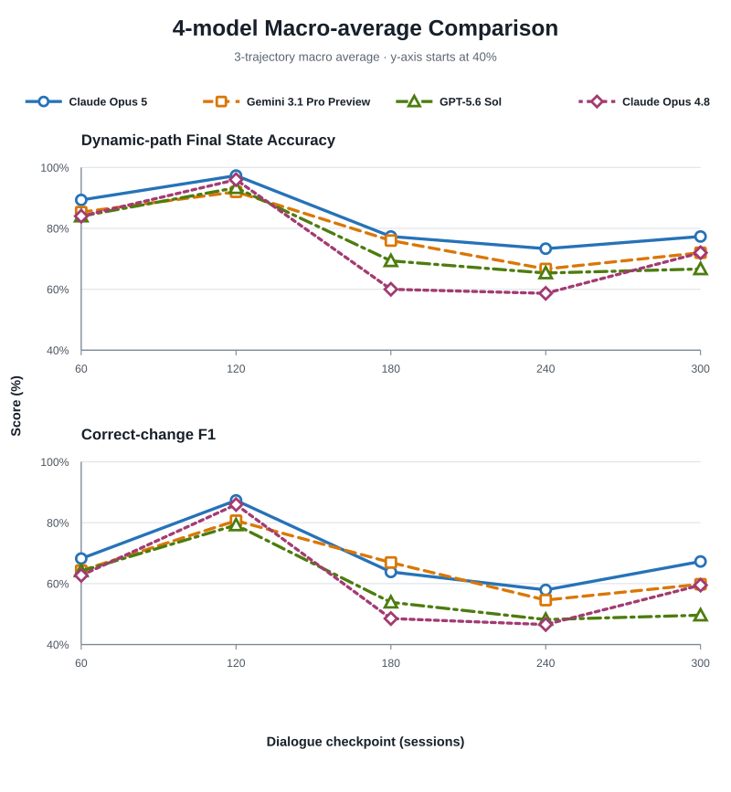

# Stage 2.2 Low Reasoning: Four-model Three-trajectory Comparison

## Technical Summary

- Claude Opus 4.8을 `traj_002`, `traj_003`, `traj_010`의 checkpoints 60, 120,
  180, 240, 300에 추가했다. 각 checkpoint는 이전 prediction을 전달하지 않는
  독립 요청이며, 네 모델 모두 Low reasoning과 provider-default sampling을
  사용했다.
- 3-trajectory macro average에서 Claude Opus 5가 두 headline metrics 모두
  가장 높았다. Claude Opus 4.8은 Dynamic-path Final State Accuracy 74.13%,
  Correct-change F1 60.65%로 Opus 5보다 각각 8.80%p, 8.27%p 낮았다.
- Opus 4.8은 GPT-5.6 Sol보다 Dynamic-path Final State Accuracy는 1.60%p
  낮았지만 Correct-change F1은 1.65%p 높았다. 따라서 이 smoke만으로
  “Opus 4.8이 항상 열위”라고 해석할 수는 없으며, 최종값 복원과 변경 탐지를
  구분해 봐야 한다.
- Opus 4.8 응답은 15/15 모두 JSON parsing과 semantic scoring에 성공했다.
  이 중 2개에는 state 결과와 별개인 evidence ID 형식 warning이 있었다.

이 문서는 Gemini retry를 반영한 기존
[`stage2_2_low_traj002_003_010_retry_v2_report.md`](stage2_2_low_traj002_003_010_retry_v2_report.md)를
덮어쓰지 않고 Claude Opus 4.8을 추가한 새 version이다.

## Opus 5가 두 Headline Metrics에서 가장 높았다

아래 compact figure는 각 모델의 3-trajectory macro average를 checkpoint별로
겹쳐 보여준다. 위 panel은 현재 Gold 값을 맞힌 비율인 Dynamic-path Final State
Accuracy, 아래 panel은 “바뀌어야 하는 path를 바뀐 값까지 정확히 맞혔는지”를
평가하는 Correct-change F1이다. y축은 모델 차이를 읽기 위해 40%에서 시작하므로
절대 성능은 아래 표의 수치와 함께 해석해야 한다.

| Model | Dynamic-path Final State Accuracy | Correct-change F1 |
|---|---:|---:|
| Claude Opus 5 | **82.93** | **68.92** |
| Gemini 3.1 Pro Preview | 78.40 | 65.25 |
| GPT-5.6 Sol | 75.73 | 59.01 |
| Claude Opus 4.8 | 74.13 | 60.65 |

각 값은 먼저 trajectory 내부 다섯 checkpoints를 평균한 뒤 세 trajectories를
동일 가중한 descriptive macro average다. trajectories가 3개뿐이므로 이 표는
모델 순위에 대한 통계적 추론이 아니라 smoke 결과의 기술통계다.

## Opus 4.8은 Trajectory에 따라 성능 변동이 컸다

| Trajectory | Final State Accuracy | Dynamic-path Final State Accuracy | Correct-change F1 | Path-macro Correct-change F1 | Event-macro Update Accuracy | Retention-after-update |
|---|---:|---:|---:|---:|---:|---:|
| `traj_002` | 77.65 | 76.80 | 57.87 | 64.12 | 74.13 | 64.23 |
| `traj_003` | 78.24 | 78.40 | 68.66 | 69.61 | 71.67 | 70.25 |
| `traj_010` | 69.41 | 67.20 | 55.42 | 55.33 | 60.52 | 57.12 |
| **3-trajectory average** | **75.10** | **74.13** | **60.65** | **63.44** | **68.77** | **63.87** |

`traj_003`에서 Opus 4.8의 Correct-change F1은 68.66%였지만 `traj_010`에서는
55.42%였다. 특히 `traj_010` checkpoint 180은 Dynamic-path Accuracy 40.00%,
Correct-change F1 25.00%로 낮았다. 따라서 평균 한 개만 보고 모델의
state-tracking 능력을 판단하기보다 trajectory 및 checkpoint 분산을 함께
보고해야 한다.

## 전체 Metric Set은 최종값·변경 탐지·유지를 분리한다

| Model | Final State Accuracy | Dynamic-path Final State Accuracy | Correct-change F1 | Path-macro Correct-change F1 | Event-macro Update Accuracy | Retention-after-update |
|---|---:|---:|---:|---:|---:|---:|
| Claude Opus 5 | **80.00** | **82.93** | **68.92** | **72.73** | **76.35** | **75.56** |
| Gemini 3.1 Pro Preview | 79.02 | 78.40 | 65.25 | 68.43 | 66.57 | 68.30 |
| GPT-5.6 Sol | 73.73 | 75.73 | 59.01 | 60.63 | 72.50 | 65.53 |
| Claude Opus 4.8 | 75.10 | 74.13 | 60.65 | 63.44 | 68.77 | 63.87 |

- **Final State Accuracy**는 schema의 전체 path에서 prediction의 최종값이
  Gold와 같은 비율이다. unchanged path가 많으면 initial-state copy baseline이
  과대평가될 수 있다.
- **Dynamic-path Final State Accuracy**는 20개 trajectories 중 적어도 한 번
  실제 Gold 값이 바뀌는 path만 대상으로 최종값 일치율을 계산한다.
- **Correct-change F1**은 checkpoint의 initial state와 Gold가 다른 cell을
  positive로 두고, 모델이 그 cell을 바뀐 최종값까지 정확히 맞힌 경우만 true
  positive로 계산한다.
- **Path-macro Correct-change F1**은 dynamic path마다 Correct-change F1을
  계산한 뒤 path를 동일 가중한다. 자주 등장하는 path가 micro score를
  지배하는 것을 막는다.
- **Event-macro Update Accuracy**는 각 Gold event가 요구하는 update들을
  event별로 채점한 뒤 event를 동일 가중한다.
- **Retention-after-update**는 한 번 올바르게 반영된 Gold update가 이후
  checkpoint에서도 유지되는지를 평가한다.

## Scope와 Aggregation

- trajectories: `traj_002`, `traj_003`, `traj_010`
- checkpoints: 60, 120, 180, 240, 300
- models: Claude Opus 5, Gemini 3.1 Pro Preview, GPT-5.6 Sol, Claude Opus 4.8
- inference: Low reasoning, provider-default sampling
- checkpoint independence: 이전 checkpoint prediction과 response를 다음
  checkpoint에 전달하지 않음
- Gemini replacement: `traj_002` checkpoint 240의 최초 malformed JSON을
  사전과 동일한 설정의 성공 retry로 대체한 retry-adjusted 결과

$$
Metric_{\mathrm{3traj}}
=
\frac{1}{3}
\sum_{t\in\{002,003,010\}}
\left(
\frac{1}{5}
\sum_{k\in\{60,120,180,240,300\}}
Metric_{t,k}
\right)
$$

## Opus 4.8 Execution과 Validation

Opus 4.8은 `claude-opus-4-8`을 고정하고 adaptive thinking의
`effort=low`, `temperature` omitted, `max_output_tokens=20,000`을 사용했다.
첫 plan은 15개 checkpoint를 병렬 제출했으나 120초 client read timeout으로
3개 결과만 저장하고 종료했다. 사용자 승인 후 저장되지 않은 12개만 300초
timeout으로 재실행했다. 두 plan 결과는 trajectory-checkpoint 기준 중복이 없고
합쳐서 정확히 15개다.

| Validation measure | Result |
|---|---:|
| Expected Opus 4.8 responses | 15 |
| Parsed and scored state responses | 15/15 (100.00%) |
| State parse failures | 0/15 (0.00%) |
| Evidence validation warning rows | 2/15 (13.33%) |

두 warning은 `traj_010` checkpoints 180과 240에서 `D57`, `D71`처럼
zero-padding이 없는 evidence ID를 출력한 사례다. scorer는 이를
`invalid_or_future_evidence`로 기록했지만 state JSON 자체는 유효했으므로
semantic metrics는 계산했다. 정식 논문에서는 **state reconstruction quality**와
**evidence citation compliance**를 별도 reliability 결과로 보고하는 것이 맞다.

## 비용과 Budget Accounting

| Opus 4.8 run | Ledger treatment |
|---|---:|
| 첫 plan: 3개 확인 + 12개 billing 불명 | $11.970 conservative upper bound |
| continuation: 12개 확인 | $7.068 rounded usage estimate |
| **fresh allowance 누계** | **$19.038 / $20.000** |

첫 plan의 timeout 이후 provider billing 상태를 확인할 수 없어, 저장되지 않은
12개도 최대 output cap까지 청구됐다고 가정한 보수적 상한을 원장에 남겼다.
따라서 $19.038은 실제 invoice가 아니라 중복 청구 가능성까지 포함한 upper
bound다. continuation의 확인된 usage-based 계산은 $7.067235였고, 최초 $6
reservation을 초과했다. 정식 실행 전에는 이번 실측 token usage로 reservation
estimate를 다시 보정해야 한다.

## Limitations와 Robustness

1. 전체 20개 중 3 trajectories, 모델·checkpoint당 1회 sample이므로 모델 순위의
   불확실성이나 sampling variance를 추정할 수 없다.
2. checkpoint별 Gold event 수와 path 구성이 다르므로, 120 이후 하락을
   context length만의 효과로 해석할 수 없다.
3. Gemini 한 건은 post-hoc retry-adjusted 값이다. 정식 실험 전 모든 모델에
   동일한 retry eligibility, 최대 횟수, score replacement rule을 고정해야 한다.
4. Opus 4.8의 첫 plan timeout은 client wait 설정 문제이며, 모델의 semantic
   failure와 동일하게 취급하지 않았다. 반면 evidence warning 두 건은 별도
   compliance failure로 보존했다.
5. 네 모델의 가격, latency, output length가 다르므로 이번 표는 quality-only
   비교이며 deployment utility 또는 cost efficiency를 직접 비교하지 않는다.

## Recommended Next Steps

1. Opus 4.8을 포함한 정식 20-trajectory 실행 전, 모델별 실측 usage로
   per-plan cost upper bound와 request timeout을 다시 산정한다.
2. parse/schema failure에 한해 최대 1회 동일 요청 retry를 허용하고,
   first-attempt Parse Success와 retry-adjusted semantic metrics를 함께 보고한다.
3. trajectory를 resampling unit으로 paired bootstrap confidence interval을
   계산해 모델 간 차이의 불확실성을 보고한다.
4. headline은 Dynamic-path Final State Accuracy와 Correct-change F1로 유지하고,
   Path-macro F1, Event-macro Accuracy, Retention을 진단 metric으로 함께 낸다.

## Further Questions

- Opus 4.8과 GPT의 Dynamic-path Accuracy와 Correct-change F1 순서가 엇갈린
  패턴이 전체 20 trajectories에서도 유지되는가?
- evidence ID normalization을 parser에서 허용할지, strict compliance metric으로
  유지할지 논문 protocol에 어떻게 고정할 것인가?
- 같은 checkpoint를 반복 sampling했을 때 model difference보다 within-model
  variance가 더 큰가?
