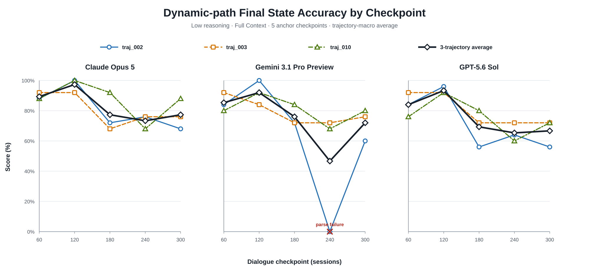
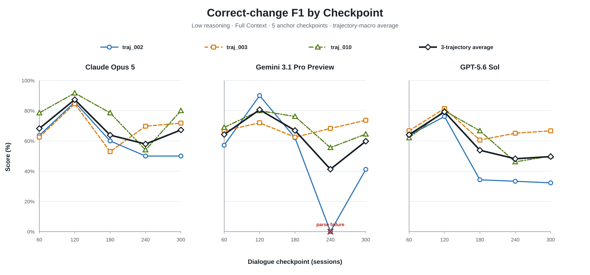

# Stage 2.2 Low Reasoning: `traj_002`, `traj_003`, `traj_010`

## Technical Summary

- **3-trajectory macro average에서는 Claude가 두 headline metrics 모두 가장
  높았다.** Dynamic-path Final State Accuracy는 Claude 82.93%, GPT 75.73%,
  Gemini 74.40%였고 Correct-change F1은 Claude 68.92%, Gemini 62.58%,
  GPT 59.01%였다.
- **trajectory별 편차가 모델 간 평균 차이만큼 크다.** Correct-change F1에서
  Claude는 61.87–76.57%, Gemini는 50.08–69.05%, GPT는 47.94–68.11% 범위였다.
- **checkpoint 120 이후 성능 하락이 세 모델 평균에서 공통으로 보인다.** 그러나
  checkpoint는 context length뿐 아니라 서로 다른 Gold update 구성을 가지므로
  이 결과만으로 long-context degradation을 인과적으로 주장할 수 없다.
- **총 45 responses 중 parse failure는 1건이다.** Gemini `traj_002`,
  checkpoint 240이 malformed JSON을 반환했으며 protocol대로 0점으로 포함했다.

이 결과는 세 trajectory로 범위를 넓힌 smoke다. 모델 순위나 reasoning policy의
최종 결론으로 사용하기보다 전체 20 trajectories 실행 전 분산과 실패 양상을
확인하는 근거로 사용한다.

## 개별 trajectory와 평균을 한 그림에서 비교

각 그림은 모델별 panel을 사용한다. 색·marker·line style은 trajectory를
나타내며 굵은 검은 선은 각 checkpoint에서 `traj_002`, `traj_003`, `traj_010`을
동일 가중한 macro average다.

**Dynamic-path Final State Accuracy**의 macro-average curve는 checkpoint 120에서
Claude 97.33%, Gemini 92.00%, GPT 93.33%로 가장 높았다. checkpoint 240에서는
각각 73.33%, 46.67%, 65.33%였다. Gemini 평균의 큰 하락에는 `traj_002` parse
failure 0점이 포함된다.

**Correct-change F1**도 checkpoint 120에서 Claude 87.33%, Gemini 80.67%,
GPT 79.22%로 정점을 보였다. checkpoint 300에서는 Claude 67.26%, Gemini
59.79%, GPT 49.64%였다. 즉 최종 state cell 정확도와 correct-change 복원 능력
모두 later checkpoints에서 낮아지는 구간이 존재하지만, 하락 폭은 모델과
trajectory에 따라 다르다.

## Trajectory별 Headline Metrics

모든 값은 각 trajectory의 checkpoints 60, 120, 180, 240, 300 평균이며
백분율이다. Average는 먼저 trajectory 안에서 checkpoint 평균을 구한 뒤 세
trajectory를 동일 가중한 macro average다.

| Model | Unit | Dynamic-path Final State Accuracy | Correct-change F1 | Parse Errors |
|---|---|---:|---:|---:|
| Claude Opus 5 | `traj_002` | 80.80 | 61.87 | 0 |
|  | `traj_003` | 80.80 | 68.32 | 0 |
|  | `traj_010` | 87.20 | 76.57 | 0 |
|  | **3-trajectory average** | **82.93** | **68.92** | **0** |
| Gemini 3.1 Pro Preview | `traj_002` | 63.20 | 50.08 | 1 |
|  | `traj_003` | 79.20 | 68.63 | 0 |
|  | `traj_010` | 80.80 | 69.05 | 0 |
|  | **3-trajectory average** | **74.40** | **62.58** | **1** |
| GPT-5.6 Sol | `traj_002` | 71.20 | 47.94 | 0 |
|  | `traj_003` | 80.00 | 68.11 | 0 |
|  | `traj_010` | 76.00 | 60.98 | 0 |
|  | **3-trajectory average** | **75.73** | **59.01** | **0** |

`traj_010` 하나에서는 Gemini가 GPT보다 Dynamic-path Accuracy가 높았지만,
3-trajectory average에서는 GPT가 1.33%p 높았다. 반대로 Correct-change F1은
Gemini가 GPT보다 3.58%p 높았다. 따라서 한 trajectory의 모델 순위를 일반화하면
안 되며, 두 headline metrics도 서로 다른 능력을 측정한다.

## 전체 Metric Set의 3-trajectory Average

| Model | Final State Accuracy | Dynamic-path Final State Accuracy | Correct-change F1 | Path-macro Correct-change F1 | Event-macro Update Accuracy | Retention-after-update |
|---|---:|---:|---:|---:|---:|---:|
| Claude Opus 5 | **80.00** | **82.93** | **68.92** | **72.73** | **76.35** | **75.56** |
| Gemini 3.1 Pro Preview | 74.71 | 74.40 | 62.58 | 67.30 | 66.57 | 67.19 |
| GPT-5.6 Sol | 73.73 | 75.73 | 59.01 | 60.63 | 72.50 | 65.53 |

Claude는 여섯 aggregate metrics에서 모두 가장 높았다. Gemini와 GPT 비교는
metric에 따라 달라졌다. GPT는 Dynamic-path Accuracy와 Event-macro Update
Accuracy가 높았고, Gemini는 Correct-change F1, Path-macro F1,
Retention-after-update가 높았다. 따라서 하나의 종합 점수로 축약하지 않고
metric set을 함께 보고하는 것이 적절하다.

## Parse Failure는 primary score에 포함

Gemini `traj_002`, checkpoint 240 응답은 output 한도에 도달하지 않았지만
`household.children` cell에서 `{"value":[],,"status":...}`처럼 comma가 중복된
malformed JSON을 반환했다. `max_output_tokens=20,000` 중 1,047 candidate tokens를
사용했으므로 truncation failure가 아니다.

Protocol은 semantic repair call과 자동 재시도를 허용하지 않는다. 따라서 해당
checkpoint의 metrics는 0이며 trajectory와 macro average에 포함된다. 그래프의
붉은 `×`가 이 지점을 표시한다. Valid-only average를 primary result로 대체하면
실제 배포에서 중요한 structured-output reliability를 숨기므로 보고하지 않는다.

## Scope, Metric과 집계 정의

- 대상: `traj_002`, `traj_003`, `traj_010`
- checkpoint: 60, 120, 180, 240, 300
- inference: 세 모델 모두 Low reasoning, provider-default sampling
- 입력: `S000 + 해당 checkpoint까지의 answer-free dialogue`
- 실행: checkpoint마다 새 method/client, 다른 prediction 공유 없음
- 자동 재시도: 0

**Dynamic-path Final State Accuracy**는 전체 데이터에서 실제 transition이 존재하는
25개 paths의 최종 `value+status` 정확도다. **Correct-change F1**은 initial state
대비 변경 여부와 변경된 최종 cell을 모두 맞혀야 correct change로 인정한다.

전체 average는 pooled cell micro-average가 아니다. 각 trajectory 안에서 다섯
checkpoint를 평균하고, 마지막에 trajectory 세 개를 동일 가중한다.

$$
Metric_{\mathrm{3traj}}
=
\frac{1}{3}
\sum_{t\in\{002,003,010\}}
\left(
\frac{1}{5}
\sum_{k\in\{60,120,180,240,300\}}
Metric_{t,k}
\right)
$$

Path-macro, Event-macro와 Retention metric은 각 metric의 기존 aggregation contract를
유지한 뒤 trajectory를 동일 가중한다.

## 비용

| Trajectory | Estimated usage-based cost | Ledger amount |
|---|---:|---:|
| `traj_002` | $4.121450 | $4.122 |
| `traj_003` | $4.243427 | $4.244 |
| `traj_010` | $4.155650 | $4.156 |
| **Low 3-trajectory total** | **$12.520527** | **$12.522** |

현재 reset 이후 원장 누계는 Medium `traj_010` 실행을 포함해
`$17.301 / $20.000`이다. 실제 provider invoice가 최종 기준이다.

## Limitations와 Robustness

1. 세 trajectories는 전체 20개 중 일부이므로 모집단 수준 모델 순위를 확정하지
   못한다.
2. trajectory와 model별 한 번만 실행해 provider-default sampling variance를
   분리하지 못한다.
3. checkpoints는 동일 session count지만 Gold update의 개수와 난이도는 서로 다르다.
4. checkpoint 240의 하락은 context length, event composition, retention lag가
   함께 변한 결과이므로 long-context degradation의 인과 추정치가 아니다.
5. `low`는 provider 간 동일 compute budget을 뜻하지 않는다.

검증된 사항은 9개 output manifests의 `COMPLETE`, 45개 frozen requests,
Low payload, temperature 생략, checkpoint 독립성, zero retry, 동일 parser/scorer,
미래 session 누출 차단이다.

## Recommended Next Steps

1. Low를 main profile로 유지하고 전체 20 trajectories에 동일 protocol을 적용한다.
2. trajectory를 resampling unit으로 paired confidence intervals를 계산한다.
3. parse success를 quality metric과 별도로 반드시 보고한다.
4. 전체 run에서는 trajectory별 event count와 retention lag 분포를 함께 확인해
   checkpoint 하락의 구성 요인을 분리한다.
5. 남은 allowance는 추가 재시도에 사용하지 않고 full-run 비용 계획을 새로
   승인받을 때까지 보존한다.
