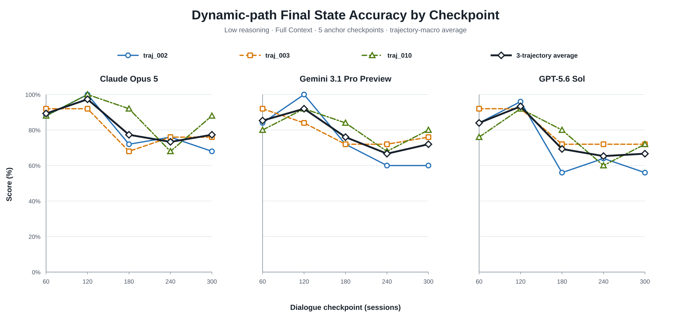
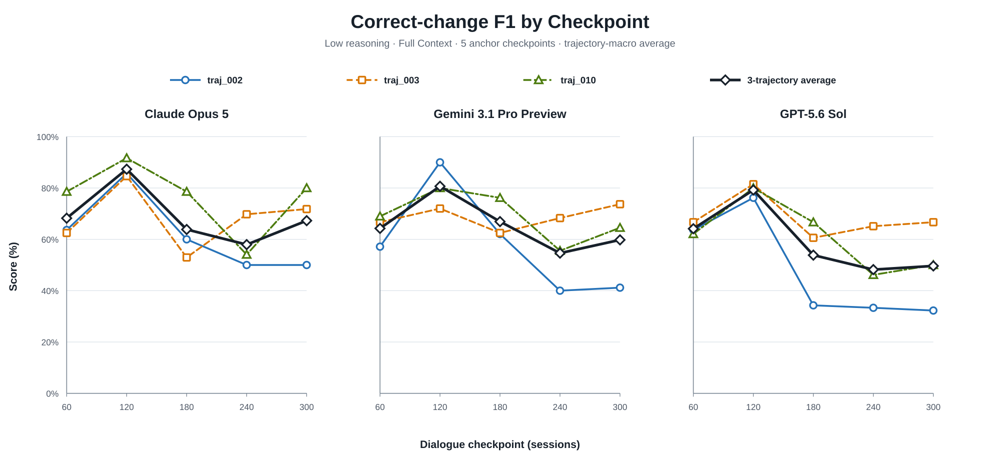
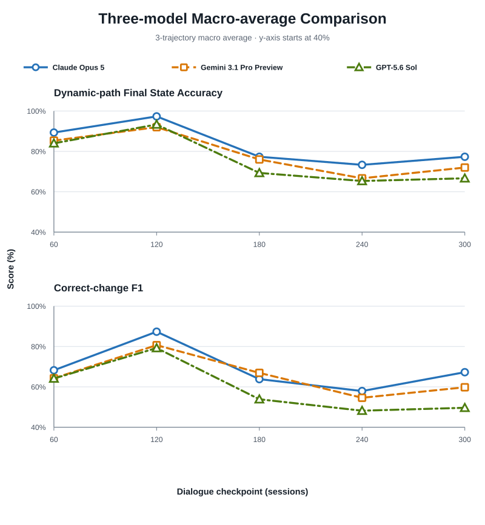

# Stage 2.2 Low Reasoning: Three-Trajectory Retry v2

## Technical Summary

- Gemini `traj_002`, checkpoint 240의 malformed JSON 한 건을 동일한 Low
  설정으로 재실행했고 JSON/schema validation을 통과했다.
- 재실행 checkpoint의 Dynamic-path Final State Accuracy는 60.00%,
  Correct-change F1은 40.00%였다.
- retry를 반영한 3-trajectory macro average에서도 Claude가 두 headline
  metrics 모두 가장 높았다. Gemini는 GPT보다 두 metric 모두 높아졌다.
- 최초 시도 기준 parse success는 44/45, retry 반영 후 usable response는
  45/45다. 형식 안정성을 숨기지 않기 위해 두 수치를 구분해 보고한다.

이 문서는 최초 실패를 0점으로 포함한
[`stage2_2_low_traj002_003_010_report.md`](stage2_2_low_traj002_003_010_report.md)를
덮어쓰지 않는 v2 분석이다.

## Trajectory별 결과와 평균

각 그림은 `traj_002`, `traj_003`, `traj_010`을 개별 선으로 표시하고 굵은 검은
선으로 checkpoint별 3-trajectory macro average를 표시한다.

Gemini `traj_002`의 checkpoint-240 값이 0%에서 60%로 대체되면서 Gemini
macro-average curve의 해당 지점은 46.67%에서 66.67%로 바뀌었다. 그래도
checkpoint 120 이후 세 모델 모두 낮아지는 구간이 있지만, checkpoint마다 Gold
event 구성이 다르므로 이를 context-length effect로 단정할 수 없다.

Correct-change F1에서도 Gemini macro-average checkpoint-240 값은 41.28%에서
54.62%로 수정됐다. 이는 retry policy가 단순 형식 성공률뿐 아니라 headline
quality score에도 영향을 주므로, first-attempt와 retry-adjusted 결과를 구분해야
함을 보여준다.

### 모델별 Macro-average 직접 비교

아래 compact figure는 앞의 모델별 panel에서 검은색이었던 3-trajectory average만
모아 모델별 색상으로 겹친 것이다. 위 panel은 Dynamic-path Final State Accuracy,
아래 panel은 Correct-change F1이다. Claude가 모든 checkpoint에서 항상 1위인 것은
아니지만, 두 metric의 다섯-checkpoint 평균에서는 가장 높다. 모델 간 차이를
읽기 쉽도록 y축은 40%에서 시작하며, 절대 크기 비교에는 앞의 0–100% figure를
사용해야 한다.

모든 값은 checkpoints 60, 120, 180, 240, 300의 평균이며 백분율이다.
Average는 trajectory 내부 checkpoint 평균을 먼저 계산한 뒤 세 trajectories를
동일 가중한다.

| Model | Unit | Dynamic-path Final State Accuracy | Correct-change F1 |
|---|---|---:|---:|
| Claude Opus 5 | `traj_002` | 80.80 | 61.87 |
|  | `traj_003` | 80.80 | 68.32 |
|  | `traj_010` | 87.20 | 76.57 |
|  | **3-trajectory average** | **82.93** | **68.92** |
| Gemini 3.1 Pro Preview | `traj_002` | 75.20 | 58.08 |
|  | `traj_003` | 79.20 | 68.63 |
|  | `traj_010` | 80.80 | 69.05 |
|  | **3-trajectory average** | **78.40** | **65.25** |
| GPT-5.6 Sol | `traj_002` | 71.20 | 47.94 |
|  | `traj_003` | 80.00 | 68.11 |
|  | `traj_010` | 76.00 | 60.98 |
|  | **3-trajectory average** | **75.73** | **59.01** |

최초 실패를 0점으로 포함한 v1과 비교하면 Gemini의 3-trajectory Dynamic-path
Accuracy는 74.40%에서 78.40%로 4.00%p, Correct-change F1은 62.58%에서
65.25%로 2.67%p 상승했다. Claude와 GPT 결과는 변경되지 않았다.

## 전체 Metric Set의 3-Trajectory Average

| Model | Final State Accuracy | Dynamic-path Final State Accuracy | Correct-change F1 | Path-macro Correct-change F1 | Event-macro Update Accuracy | Retention-after-update |
|---|---:|---:|---:|---:|---:|---:|
| Claude Opus 5 | **80.00** | **82.93** | **68.92** | **72.73** | **76.35** | **75.56** |
| Gemini 3.1 Pro Preview | 79.02 | 78.40 | 65.25 | 68.43 | 66.57 | 68.30 |
| GPT-5.6 Sol | 73.73 | 75.73 | 59.01 | 60.63 | 72.50 | 65.53 |

Claude는 여섯 aggregate metrics 모두 가장 높았다. Gemini는 GPT보다 Final State
Accuracy, Dynamic-path Accuracy, 두 Correct-change F1, Retention에서 높았고,
GPT는 Event-macro Update Accuracy에서 높았다.

## Retry와 Parse Reliability

최초 Gemini 응답은 `household.children` cell의 중복 comma로 인해 파싱되지
않았다. 단일 retry는 동일 item, 모델, Low reasoning profile,
provider-default sampling, `max_output_tokens=20,000`을 사용했다. retry 응답은
57,037 input tokens와 2,003 output tokens를 사용했고 validation error 없이
완료됐다.

| Reliability measure | Result |
|---|---:|
| First-attempt Parse Success | 44/45 (97.78%) |
| Retry attempts | 1 |
| Retry success | 1/1 (100.00%) |
| Final usable responses | 45/45 (100.00%) |

이번 v2 quality score는 성공한 retry 응답으로 최초 실패 checkpoint를 대체한다.
다만 이는 smoke 이후 사용자 요청으로 추가된 post-hoc retry다. 정식 실험에서
재현성과 모델 간 공정성을 보장하려면 “parse/schema failure에 한해 최대 1회
동일 요청 재시도”처럼 retry policy를 사전에 고정하고 모든 모델에 동일하게
적용해야 한다. 논문에는 first-attempt parse success와 retry-adjusted quality
metrics를 함께 보고하는 것이 적절하다.

## Scope와 집계

- trajectories: `traj_002`, `traj_003`, `traj_010`
- checkpoints: 60, 120, 180, 240, 300
- models: Claude Opus 5, Gemini 3.1 Pro Preview, GPT-5.6 Sol
- inference: Low reasoning, provider-default sampling
- checkpoint independence: 이전 checkpoint prediction 공유 없음
- replacement: Gemini `traj_002` checkpoint 240 한 건만 retry plan으로 대체

$$
Metric_{\mathrm{3traj}}
=
\frac{1}{3}
\sum_{t\in\{002,003,010\}}
\left(
\frac{1}{5}
\sum_{k\in\{60,120,180,240,300\}}
Metric_{t,k}
\right)
$$

## 비용

| Run | Usage-based estimate | Ledger amount |
|---|---:|---:|
| 기존 Low 3 trajectories | $12.520527 | $12.522 |
| Gemini checkpoint-240 retry | $0.138110 | $0.139 |
| **Low 결과 + retry** | **$12.658637** | **$12.661** |

reset 이후 전체 원장 누계는 Medium `traj_010`을 포함해
`$17.440 / $20.000`이다. 실제 provider invoice가 최종 기준이다.

## Interpretation

retry 후에도 세 trajectories만으로 전체 모델 순위를 확정할 수는 없다. 다만
한 parse failure를 0점으로 처리할지 재시도할지가 모델 평균을 의미 있게 바꿀 수
있음을 확인했다. 따라서 본 실험에서는 semantic performance와 structured-output
reliability를 분리하되 함께 보고해야 한다.

## Limitations와 Robustness

1. 세 trajectories는 전체 20개 중 일부이므로 모델 순위의 불확실성을 추정하기
   부족하다.
2. retry는 smoke 결과 확인 후 결정된 post-hoc 조치이며, 사전 등록된 공통 retry
   policy가 아니었다.
3. provider-default sampling을 사용하므로 최초 응답과 retry의 차이에는 sampling
   variance가 포함된다.
4. checkpoint별 Gold event 수와 retention lag가 같지 않아 checkpoint 곡선만으로
   long-context degradation을 식별할 수 없다.
5. retry 전후 모두 동일 parser와 scorer를 사용했으며, 최초 paid output과 v1
   분석을 보존해 결과 선택 과정을 감사할 수 있게 했다.

## Recommended Next Steps

1. 정식 20-trajectory 실행 전에 parse/schema failure에 대한 최대 retry 횟수와
   score 대체 규칙을 고정한다.
2. first-attempt Parse Success, retry success, final usable response rate를 semantic
   metrics와 별도로 보고한다.
3. quality headline은 retry-adjusted 값을 사용하되, retry가 실패하면 해당
   checkpoint를 0점 처리하는 규칙을 모든 모델에 동일하게 적용한다.
4. trajectory를 resampling unit으로 paired confidence interval을 계산한다.

## Further Questions

- retry를 허용하지 않은 first-attempt quality와 retry-adjusted quality 중 어느
  값을 논문의 primary endpoint로 둘 것인가?
- 같은 모델·checkpoint를 반복했을 때 semantic score variance는 어느 정도인가?
- 모델별 structured-output failure rate 차이가 전체 20 trajectories에서도
  유지되는가?
