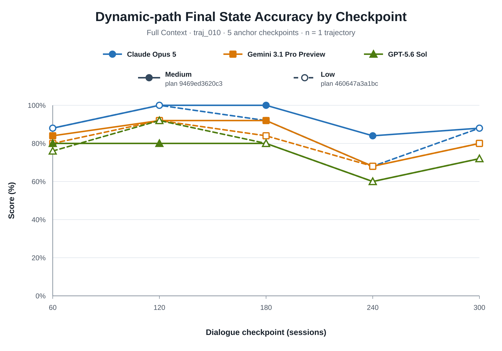
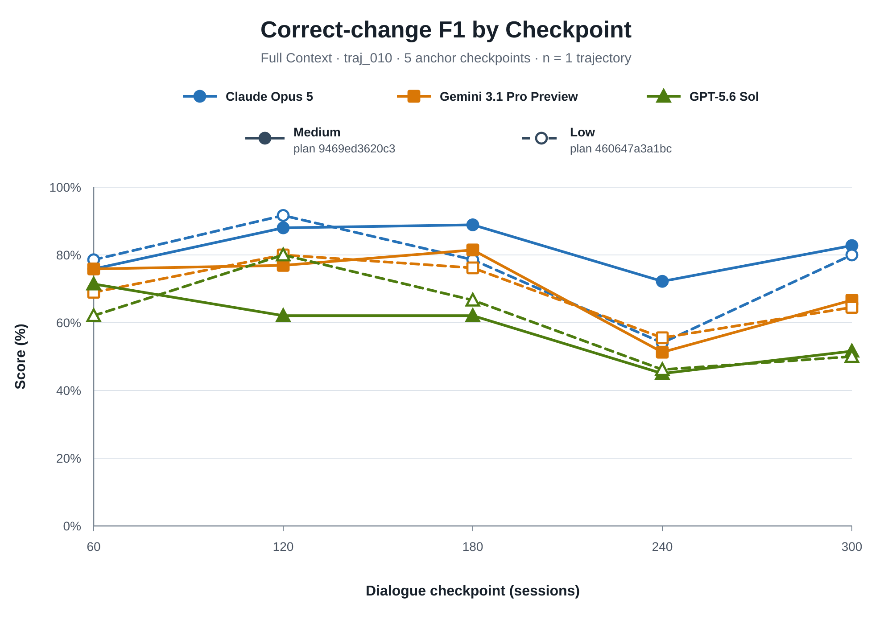

# Stage 2.2 `traj_010`: Medium vs Low Reasoning 비교

## Technical Summary

- **Low reasoning의 품질 효과는 모델별로 일관되지 않았다.** 두 headline
  metrics에서 Claude는 하락했고, Gemini는 소폭 하락했으며, GPT는 소폭 상승했다.
- **Low reasoning은 output usage를 확실히 줄였다.** 세 모델의 billable output
  tokens 합계는 69,293에서 38,386으로 44.6% 감소했고, 표준 단가 기준 추정
  비용은 `$4.778541`에서 `$4.155650`으로 13.0% 감소했다.
- **형식 안정성은 두 profile에서 동일했다.** Medium과 Low 모두 15/15 responses가
  JSON/schema를 통과했으며 자동 재시도는 없었다.
- **이 결과로 reasoning level의 우열을 결정하면 안 된다.** 하나의 trajectory와
  profile별 단일 stochastic run만 비교했으므로 관측 차이는 sampling variation과
  trajectory 특이성의 영향을 함께 포함한다.

논문에서는 Medium을 main deployment-realistic setting으로 유지하고, Low를
reasoning-compute sensitivity arm으로 보고하는 것이 가장 방어 가능하다.

## Headline Metrics는 모델별로 다른 방향으로 움직였다

아래 그림에서 색과 marker shape는 모델을, 선 모양과 marker 채움은 reasoning
level을 나타낸다. Medium은 실선·채운 marker, Low는 점선·빈 marker다.

**Dynamic-path Final State Accuracy** 평균은 Claude `92.0→87.2`(-4.8%p),
Gemini `83.2→80.8`(-2.4%p), GPT `74.4→76.0`(+1.6%p)였다. GPT의 상승 때문에
“reasoning을 낮추면 항상 성능이 낮아진다”는 단조 관계는 이 smoke에서 관측되지
않았다.

**Correct-change F1**도 Claude `81.55→76.57`(-4.97%p), Gemini
`70.44→69.05`(-1.40%p), GPT `58.44→60.98`(+2.54%p)로 같은 방향성을 보였다.
다만 checkpoint별 곡선은 여러 번 교차한다. profile별 반복 실행 없이 이 교차를
reasoning level의 인과 효과로 해석할 수 없다.

## Aggregate 결과에서는 metric에 따라서도 결론이 달라진다

모든 값은 `traj_010`의 checkpoints 60, 120, 180, 240, 300 평균이며 백분율이다.
Delta는 `Low − Medium`의 percentage points다.

| Model | Metric | Medium | Low | Delta |
|---|---|---:|---:|---:|
| Claude Opus 5 | Final State Accuracy | 86.47 | 83.53 | -2.94 |
|  | Dynamic-path Final State Accuracy | 92.00 | 87.20 | -4.80 |
|  | Correct-change F1 | 81.55 | 76.57 | -4.97 |
|  | Path-macro Correct-change F1 | 80.00 | 73.91 | -6.09 |
|  | Event-macro Update Accuracy | 88.12 | 82.92 | -5.21 |
|  | Retention-after-update | 87.50 | 82.99 | -4.51 |
| Gemini 3.1 Pro Preview | Final State Accuracy | 79.41 | 80.59 | +1.18 |
|  | Dynamic-path Final State Accuracy | 83.20 | 80.80 | -2.40 |
|  | Correct-change F1 | 70.44 | 69.05 | -1.40 |
|  | Path-macro Correct-change F1 | 69.42 | 70.87 | +1.45 |
|  | Event-macro Update Accuracy | 69.38 | 70.42 | +1.04 |
|  | Retention-after-update | 67.36 | 73.51 | +6.15 |
| GPT-5.6 Sol | Final State Accuracy | 71.18 | 73.53 | +2.35 |
|  | Dynamic-path Final State Accuracy | 74.40 | 76.00 | +1.60 |
|  | Correct-change F1 | 58.44 | 60.98 | +2.54 |
|  | Path-macro Correct-change F1 | 56.96 | 58.12 | +1.16 |
|  | Event-macro Update Accuracy | 70.73 | 64.48 | -6.25 |
|  | Retention-after-update | 60.73 | 58.54 | -2.19 |

GPT는 두 headline metrics에서 Low가 높았지만 Event-macro Update Accuracy와
Retention-after-update는 낮았다. 따라서 headline curve만으로 “Low GPT가 더
좋다”고 말하면 update-event 반영과 장기 유지의 하락을 가리게 된다. Gemini도
Dynamic-path Accuracy와 Correct-change F1은 하락했지만 Retention은 상승했다.
이 때문에 최종 논문 표에는 요청한 전체 metric set을 함께 유지해야 한다.

## Scope와 Metric Definitions

평가 단위는 `traj_010` 한 trajectory의 다섯 독립 checkpoint다. 각 state cell은
`value`와 `status`가 모두 Gold와 같아야 정답이다.

- **Final State Accuracy**: 전체 34개 state paths의 최종 cell 정확도
- **Dynamic-path Final State Accuracy**: 전체 데이터에서 실제 Gold transition이
  존재하는 25개 paths만의 최종 cell 정확도
- **Correct-change F1**: initial state 대비 변경 여부뿐 아니라 변경된 최종
  `value+status`까지 맞힌 경우만 correct change로 인정하는 checkpoint-level F1
- **Path-macro Correct-change F1**: 실제 변경이 있는 path별 Correct-change F1의
  동일 가중 평균
- **Event-macro Update Accuracy**: Gold update event 이후 첫 평가 checkpoint에서
  해당 event가 바꾼 paths를 맞힌 비율의 event-macro 평균
- **Retention-after-update**: update가 발생한 뒤 관측 가능한 후속 checkpoints에서
  관련 paths를 계속 정확히 유지한 정도

Dynamic-path Final State Accuracy는 현재 상태 자체를 평가하고, Correct-change F1은
initial-copy baseline에 가려지지 않도록 실제 변경의 탐지와 새 값 복원을 평가한다.
두 metric은 서로 대체 관계가 아니므로 두 그래프를 모두 headline evidence로 둔다.

## Experimental Design

| Dimension | Medium | Low |
|---|---|---|
| Paid plan | `9469ed3620c32e102b4eb97f6831d291cc0f9095798c91e9fc10b140fa474b68` | `460647a3a1bcc38382800ba2e2be6114439c4d2b7f9c09e21d79296f51542bfd` |
| Claude Opus 5 | Adaptive thinking, `effort=medium` | Adaptive thinking, `effort=low` |
| Gemini 3.1 Pro Preview | `thinking_level=medium` | `thinking_level=low` |
| GPT-5.6 Sol | `effort=medium`, `mode=standard` | `effort=low`, `mode=standard` |
| Temperature | Provider request에서 미지정 | Provider request에서 미지정 |
| Max output | 20,000 tokens | 20,000 tokens |
| Checkpoint execution | 새 method/client로 각각 독립 실행 | 새 method/client로 각각 독립 실행 |
| Parallelism | 3 models × 5 checkpoints | 3 models × 5 checkpoints |
| Automatic retries | 0 | 0 |

두 run의 initial state, answer-free dialogues, Gold, checkpoint set, prompt, schema,
parser와 scorer는 동일하다. 각 checkpoint는 `S000 + 해당 checkpoint까지의
dialogue`만 입력받으며 다른 checkpoint의 prediction이나 reasoning을 보지 않는다.

## Low는 output usage와 비용을 줄였다

| Model | Medium output tokens | Low output tokens | Reduction | Medium cost | Low cost |
|---|---:|---:|---:|---:|---:|
| Claude Opus 5 | 19,819 | 13,254 | 33.1% | $2.347495 | $2.183370 |
| Gemini 3.1 Pro Preview | 30,822 | 15,739 | 48.9% | $0.792886 | $0.611890 |
| GPT-5.6 Sol | 18,652 | 9,393 | 49.6% | $1.638160 | $1.360390 |
| **Total** | **69,293** | **38,386** | **44.6%** | **$4.778541** | **$4.155650** |

Gemini output에는 answer와 thinking tokens를 모두 포함한다. 입력 token 수는 각
profile에서 모델별로 동일했다. Low의 비용 감소율이 output token 감소율보다 작은
이유는 장문 dialogue의 input 비용이 그대로 유지되기 때문이다.

## Limitations와 Robustness

1. **한 trajectory뿐이다.** trajectory-level variance를 추정할 수 없고 bootstrap
   interval도 모집단 불확실성을 나타내지 않는다.
2. **profile별 한 번만 실행했다.** Provider-default sampling에서 같은 prompt도
   다른 응답을 생성할 수 있으므로 작은 delta는 reasoning effect와 sampling
   variation을 분리하지 못한다.
3. **provider 간 `low`는 compute-matched가 아니다.** 동일한 token budget이나
   동일한 계산량을 의미하지 않으며 provider-supported ordinal setting이다.
4. **checkpoint는 다섯 anchor뿐이다.** 선은 관측된 점을 연결한 것이며 중간
   sessions의 성능을 측정하지 않는다.
5. **Smoke 결과로 설정을 선택하지 않았다.** 후보 집합, prompt, Gold와 scorer는
   결과를 본 뒤 변경하지 않았다.

이번 비교의 robustness check는 입력·Gold·parser 고정, 15/15 schema pass,
temperature 생략 확인, zero retry, 독립 checkpoint manifest 확인까지다.
Reasoning effect의 통계적 검증은 전체 trajectory 실행 전에는 충족되지 않는다.

## Recommended Next Steps

1. Medium을 main experiment profile로, Low를 sensitivity profile로 사전 고정한다.
2. 전체 20 trajectories에서 동일한 paired checkpoint set으로 두 profile을 실행한다.
3. trajectory를 resampling unit으로 사용해 paired `Low − Medium` confidence
   intervals를 계산한다.
4. 비용·output tokens·latency도 quality metrics와 함께 보고해 deployment trade-off를
   평가한다.
5. 예산이 허용되면 일부 trajectories에 반복 run을 추가해 sampling variance의
   크기를 reasoning-level delta와 비교한다.

## Further Questions

- GPT의 headline 개선과 Event/Retention 하락이 다른 trajectories에서도 반복되는가?
- Low에서 Gemini Retention 상승이 sampling variation인지 특정 update 유형에 대한
  체계적 차이인지?
- reasoning level을 낮췄을 때 감소하는 output tokens가 hidden reasoning과 final
  answer 중 어디에서 주로 발생하는가?
- paired quality delta 대비 비용과 latency 감소가 실제 금융 챗봇 운영에서
  실질적으로 의미 있는가?
